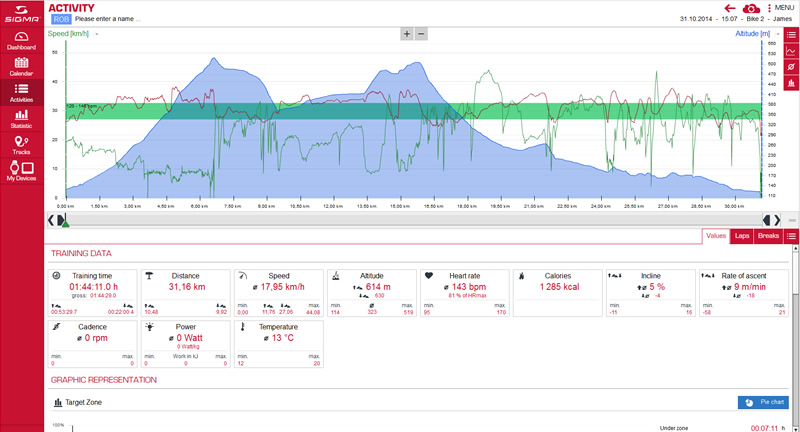

## Garmin FIT Conversion Perl Library and Scripts

This repository is a collection of Garmin FIT Perl library and scripts for
converting Garmin FIT files to other formats.  
Currently the following conversions are supported:
<table>
<tr>
  <td colspan="2"><b>Source</b></td>
  <td colspan="2"><b>Destination</b></td>
  <td><b>Extension</b></td>
</tr>
<tr>
  <td></td>
  <td>Garmin FIT</td>
  <td></td>
  <td>GPX v1.1</td>
  <td>.gpx</td>
</tr>
<tr>
  <td></td>
  <td>Garmin FIT</td>
  <td></td>
  <td>SigmaSport log file</td>
  <td>.slf</td>
</tr>
</table>

Main library for reading and parsing Garmin FIT file is a modified/updated
version of [Garmin::FIT library] by Kiyokazu Suto. If you want to update
Garmin::FIT library to the latest protocol/profile, use documentation from
the official [FIT SDK] from [thisisant.com] Web site.

Currently supported FIT protocol and profile in this version of library is:

FIT Protocol | FIT Profile
------------ |:------------
1.8          | 20.00

Some of the messages and fields used in this implementation are not described
in the latest official [FIT SDK] documentation and are therefore
experimental/unsupported. This implementation was tested on FIT files from
Garmin Edge device only. It works in both Windows and Unix environments.

Conversion scripts need to be run from the command line (there's no GUI).

### Prerequisites

You'll need the following Perl prerequisites:
- POSIX::strftime::GNU
- Data::UUID
- Config::Simple

You can install them with **ppm** on Windows (if you are using ActivePerl) or
with **cpan**:  
<pre>
$ cpan install POSIX::strftime::GNU  
$ cpan install Data::UUID  
$ cpan install Config::Simple
</pre>

### Conversion
#### Getting the FIT files

You have to copy FIT files from your Garmin (or other) device to your computer.
You'll need the **activity FIT files** only. On Garmin Edge devices these
files are stored in \Garmin\Activity subdirectory. You can also do it via 
[Garmin Connect Export option].

#### Config (ini) file

All conversion scripts can optionaly use config file in [Windows **ini** format],
which must be named as the script name with extension ***.ini*** and must
reside in the current working directory. If the config file is not found, some
reasonable defaults are applied.

Config file example (**fit2slf.ini**):
<pre>
[default]
;SigmaSport: cycling, mountainbike, racing_bycicle (road bike), running, ...
sport = mountainbike
training_type = Riding
bike = bike1

[personal]
name = John Smith
gender = male
age = 40
height = 183
weight = 75

[bike1]
name = Ibis Ripley 29 LS
type = MTB
weight = 12.3
wheel_size = 2326
</pre>
Units used in config file and in scripts are metric (kg, cm, mm, ...).

Detailed syntax and parameters used in **ini** file is described in
[Config (ini) File Syntax].

#### FIT to GPX (GPS Exchange Format)

Use **fit2gpx.pl** with optional config file **fit2gpx.ini**:
<pre>
$ fit2gpx.pl input.fit
</pre>
This produces file ```input.gpx``` in the current directory. If the file
```input.gpx``` already exists, it will not be overwritten. To force overwrite,
use:
<pre>
$ fit2gpx.pl -y input.fit
</pre>
By default a GPX file compatible with [Garmin's Track Point Extension Format v1]
is produced. If you want to produce a GPX file compatible with a
[Cluetrust GPX Extension Format], use the following:
<pre>
$ fit2gpx.pl -c input.fit
</pre>
Difference between them is in the syntax how heart rate, cadence, temperature &
power data is stored in the file. In both cases a Cluetrust extension
**&lt;gpxdata:lap&gt;** will be added to the end of file, where the following
average/min/max values are stored:

*startPoint, endPoint, startTime, elapsedTime, calories, distance, avg_speed,
max_speed, min_altitude, avg_altitude, max_altitude, total_ascent, total_descent,
distance_uphill, distance_downhill, avg_incline_uphill, avg_incline_downhill,
avg_rise_rate_uphill, avg_rise_rate_downhill, min_heart_rate, max_heart_rate,
min_percent_hrmax, avg_percent_hrmax, max_percent_hrmax, time_under_target_zone,
time_in_target_zone, time_over_target_zone, avg_power, avg_power_KJ,
avg_power_W_per_Kg, max_power, avg_cadence, max_cadence, min_temperature,
avg_temperature, max_temperature, total_cycles, total_records*

#### FIT to SLF (SigmaSport log file)

Use **fit2slf.pl** with optional config file **fit2slf.ini**:
<pre>
$ fit2slf.pl input.fit
</pre>
This produces file ```input.slf``` in the current directory. If the file
```input.slf``` already exists, it will not be overwritten. To force overwrite,
use:
<pre>
$ fit2slf.pl -y input.fit
</pre>
A lot of calculation of average/min/max values is done in addition to the
data found in FIT file. Specifically, power is calculated according to the
formulas described in J.C. Martin's paper
[Validation of a Mathematical Model for Road Cycling Power]
from 1998. You can change some of the parameters used for power calculation
in **ini** file (see [Config (ini) File Syntax]).

Resulting ```input.slf``` can be directly imported in [SigmaSport Data Center],
which is a perfect software for **offline** evaluation of cycling statistics
and training sessions.



[Garmin::FIT library]: http://pub.ks-and-ks.ne.jp/cycling/GarminFIT.shtml
[FIT SDK]: http://www.thisisant.com/resources/fit
[thisisant.com]: http://www.thisisant.com/developer/
[Garmin Connect Export option]: http://support.strava.com/hc/en-us/articles/216917807-Exporting-files-from-Garmin-Connect
[Windows **ini** format]: http://en.wikipedia.org/wiki/INI_file
[Config (ini) File Syntax]: config.md
[Garmin's Track Point Extension Format v1]: http://www.garmin.com/xmlschemas/TrackPointExtensionv1.xsd
[Cluetrust GPX Extension Format]: http://www.cluetrust.com/Schemas/gpxdata10.xsd
[Validation of a Mathematical Model for Road Cycling Power]: http://www.wisil.recumbents.com/wisil/MartinDocs/Validation%20of%20a%20mathematical%20model%20for%20road%20cycling.pdf
[SigmaSport Data Center]: http://www.sigma-data-center.com/eu/en/cmsDataCenter/1/0/0/0/data-center.html?scriptMode=cmsdatacenter
<!-- http://dcupdate.sigmasport.com/en/hinweis/ -->
